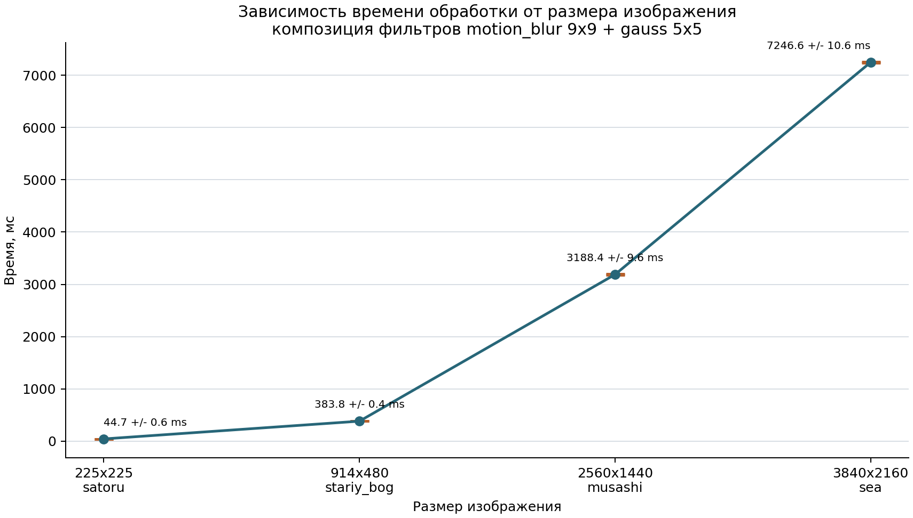

# Бенчмарк времени обработки изображений

На графике показана зависимость времени обработки от размера изображения для композиции фильтров `motion_blur 9x9 + gauss 5x5`. Использовались четыре изображения: `satoru`, `stariy_bog`, `musashi`, `sea`.

По горизонтали отложен размер изображения, по вертикали - среднее время обработки в `мс`. Чем выше точка на графике, тем дольше обрабатывалось изображение. Оранжевые интервалы показывают погрешность среднего значения времени.

В каждом измерении учитывался полный цикл обработки одного изображения:

1. чтение изображения;
2. применение `motion_blur 9x9`;
3. применение `gauss 5x5`;
4. запись результата.

Для каждого изображения выполнено по 10 измерений. В таблице указано среднее время полного цикла обработки и погрешность.

Погрешность на графике и в таблице - половина 95% доверительного интервала среднего значения времени:

`error = t_0.975,9 * s / sqrt(n)`, где `n = 10`, `t_0.975,9 = 2.262`, `s` - выборочное стандартное отклонение 10 значений времени.

| Изображение | Размер | Время, мс |
|---|---:|---:|
| `satoru` | `225x225` | `44.66 +- 0.58` |
| `stariy_bog` | `914x480` | `383.81 +- 0.40` |
| `musashi` | `2560x1440` | `3188.37 +- 9.60` |
| `sea` | `3840x2160` | `7246.61 +- 10.61` |

Время обработки растёт вместе с размером изображения: минимальное среднее время получилось на `satoru` размером `225x225`, максимальное - на `sea` размером `3840x2160`.
