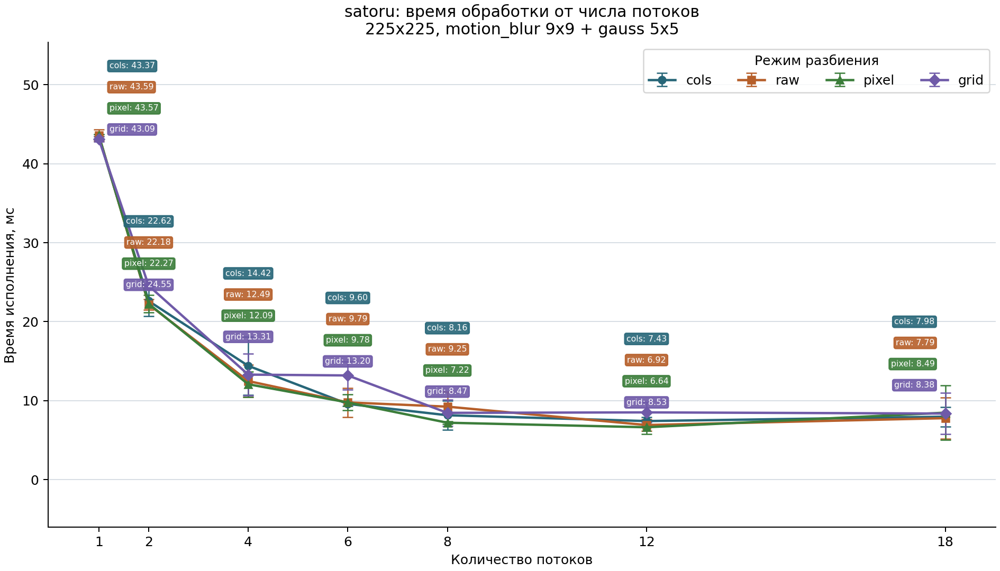
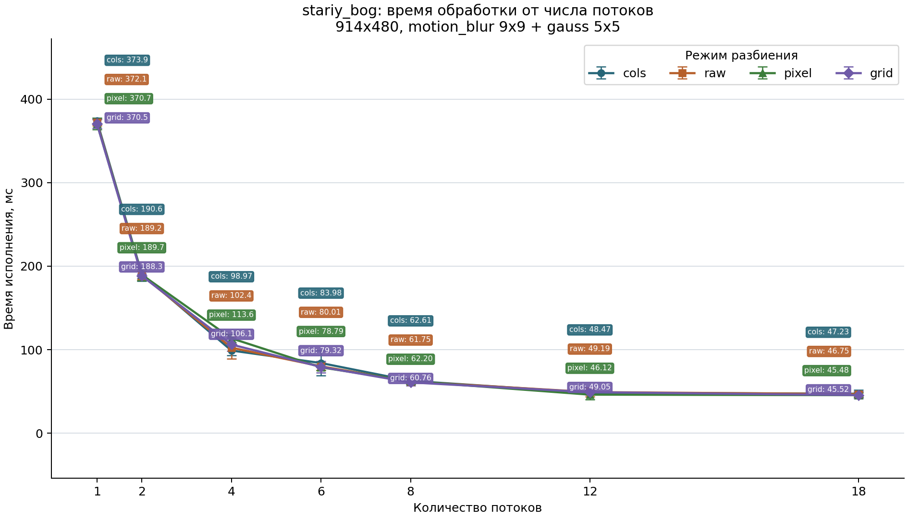
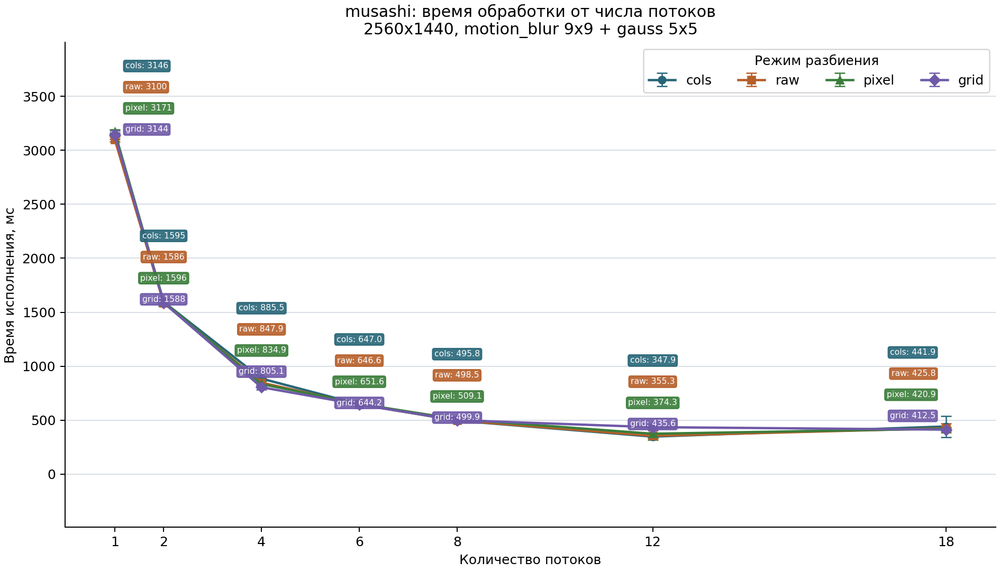
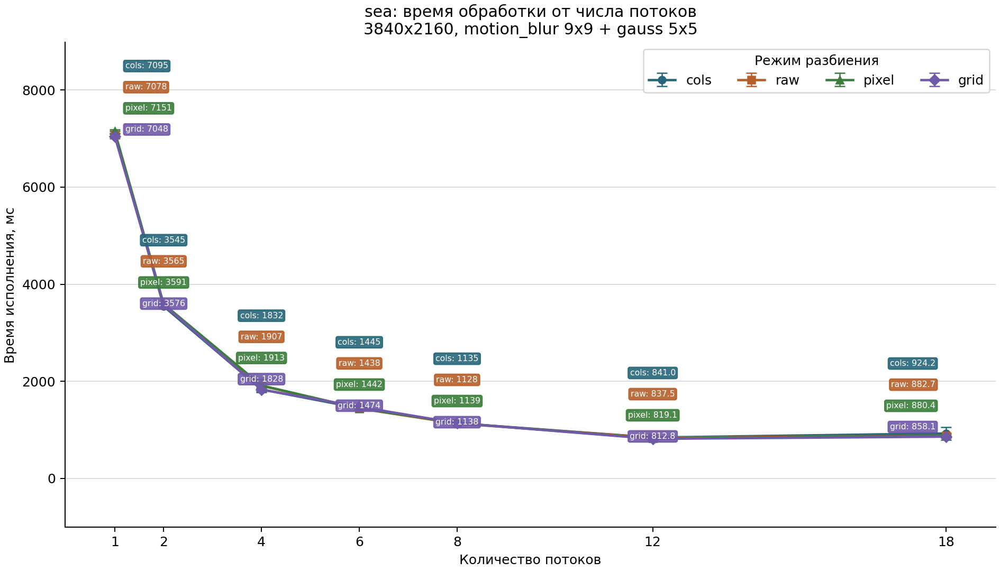

# Бенчмарк параллельной обработки изображений

Измерялась зависимость времени исполнения от количества потоков для параллельной реализации свёртки. На каждом графике показаны четыре способа параллелизма (по столбцам, по строкам, по пикселям, по гриду): `cols`, `raw`, `pixel`, `grid`.

Во всех случаях применялась одна и та же композиция фильтров: `motion_blur 9x9 + gauss 5x5`. По вертикали отложено время исполнения в миллисекундах, по горизонтали - количество потоков. Цветные прямоугольники рядом с каждым значением потоков показывают режим разбиения и среднее время по 10 запускам. Интервалы погрешности построены по 95-му перцентилю: в таблицах значение записано как `mean +- (p95 - mean)`.

Измерялось только время применения композиции фильтров к уже загруженному изображению. Чтение изображения, подготовка копии входного буфера, запись результата и построение графиков в измерение не входят.

## Аппаратные ресурсы

| Параметр | Значение |
|---|---:|
| Архитектура | `x86_64` |
| CPU | `Intel(R) Core(TM) Ultra 5 125H` |
| Логические CPU | `18` |
| Ядер на сокет | `14` |
| Потоков на ядро | `2` |
| Сокетов | `1` |
| CPU scaling | `62%` |
| CPU max/min MHz | `4600 / 400` |
| L1d cache | `448 KiB (12 instances)` |
| L1i cache | `768 KiB (12 instances)` |
| L2 cache | `14 MiB (7 instances)` |
| L3 cache | `18 MiB (1 instance)` |
| NUMA nodes | `1` |
| RAM total | `32260652 kB` |
| RAM available | `20372096 kB` |

## satoru (225x225)

| Потоки | cols, мс | raw, мс | pixel, мс | grid, мс |
|---:|---:|---:|---:|---:|
| 1 | `43.37 +- 0.38` | `43.59 +- 0.73` | `43.57 +- 0.15` | `43.09 +- 0.33` |
| 2 | `22.62 +- 1.94` | `22.18 +- 0.67` | `22.27 +- 1.12` | `24.55 +- 0.12` |
| 4 | `14.42 +- 3.67` | `12.49 +- 2.04` | `12.09 +- 1.60` | `13.31 +- 2.66` |
| 6 | `9.60 +- 0.25` | `9.79 +- 1.84` | `9.78 +- 1.01` | `13.20 +- 1.78` |
| 8 | `8.16 +- 1.82` | `9.25 +- 1.90` | `7.22 +- 0.15` | `8.47 +- 1.68` |
| 12 | `7.43 +- 0.50` | `6.92 +- 0.72` | `6.64 +- 0.83` | `8.53 +- 1.27` |
| 18 | `7.98 +- 1.24` | `7.79 +- 2.62` | `8.49 +- 3.48` | `8.38 +- 2.60` |

## stariy_bog (914x480)

| Потоки | cols, мс | raw, мс | pixel, мс | grid, мс |
|---:|---:|---:|---:|---:|
| 1 | `373.85 +- 3.78` | `372.09 +- 3.85` | `370.68 +- 6.96` | `370.50 +- 5.22` |
| 2 | `190.60 +- 8.49` | `189.17 +- 5.25` | `189.72 +- 6.82` | `188.33 +- 2.71` |
| 4 | `98.97 +- 5.87` | `102.37 +- 13.26` | `113.59 +- 4.82` | `106.11 +- 7.73` |
| 6 | `83.98 +- 14.79` | `80.01 +- 4.78` | `78.79 +- 3.29` | `79.32 +- 6.62` |
| 8 | `62.61 +- 2.71` | `61.75 +- 3.37` | `62.20 +- 3.35` | `60.76 +- 3.55` |
| 12 | `48.47 +- 2.62` | `49.19 +- 5.56` | `46.12 +- 5.65` | `49.05 +- 2.84` |
| 18 | `47.23 +- 4.67` | `46.75 +- 2.56` | `45.48 +- 2.55` | `45.52 +- 4.35` |

## musashi (2560x1440)

| Потоки | cols, мс | raw, мс | pixel, мс | grid, мс |
|---:|---:|---:|---:|---:|
| 1 | `3145.74 +- 18.19` | `3099.84 +- 21.70` | `3170.92 +- 22.00` | `3143.83 +- 38.42` |
| 2 | `1595.28 +- 21.83` | `1585.85 +- 17.96` | `1595.82 +- 13.12` | `1588.32 +- 31.36` |
| 4 | `885.53 +- 64.09` | `847.94 +- 42.13` | `834.87 +- 25.18` | `805.13 +- 20.02` |
| 6 | `646.96 +- 12.23` | `646.58 +- 10.03` | `651.55 +- 8.69` | `644.20 +- 6.45` |
| 8 | `495.77 +- 4.10` | `498.54 +- 10.13` | `509.07 +- 14.84` | `499.93 +- 7.34` |
| 12 | `347.93 +- 10.72` | `355.26 +- 22.94` | `374.35 +- 59.09` | `435.61 +- 29.07` |
| 18 | `441.94 +- 97.90` | `425.78 +- 41.61` | `420.95 +- 12.05` | `412.47 +- 12.66` |

## sea (3840x2160)

| Потоки | cols, мс | raw, мс | pixel, мс | grid, мс |
|---:|---:|---:|---:|---:|
| 1 | `7094.83 +- 61.01` | `7077.91 +- 29.20` | `7151.32 +- 36.64` | `7048.17 +- 45.98` |
| 2 | `3544.69 +- 13.05` | `3564.77 +- 26.92` | `3590.63 +- 6.64` | `3575.58 +- 23.95` |
| 4 | `1831.73 +- 57.35` | `1907.29 +- 48.01` | `1912.65 +- 131.05` | `1827.61 +- 28.31` |
| 6 | `1444.55 +- 13.00` | `1437.96 +- 24.90` | `1442.13 +- 24.80` | `1473.82 +- 22.26` |
| 8 | `1135.15 +- 21.31` | `1128.03 +- 7.99` | `1138.94 +- 13.39` | `1137.57 +- 13.89` |
| 12 | `841.05 +- 22.13` | `837.51 +- 24.32` | `819.09 +- 25.53` | `812.81 +- 26.21` |
| 18 | `924.17 +- 133.78` | `882.68 +- 49.11` | `880.43 +- 32.01` | `858.09 +- 23.09` |
